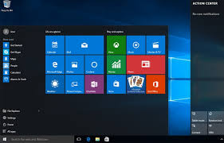

Tal Zelig

- Developing in Haskell for 5 years
- Worked at SQream.
- Now full stack developer at Atidot

</img>

---

## In This Talk

* Building frontend applications using Haskell
* Using Reflex-frp to develop them with ease
* Integrating external js libraries

---

## The Challenge

<p style="text-align: left;">Javascript, of course</p>

- Frontends are interactive
- Browser frontends run JS
- Flow is implemented by events and callbacks
- Over time it spirals down to callbacks hell
- Also, weakly typed

---

## JS Example

```javascript
<script type="text/javascript">
var clicks = 0;
function onClick() {
    clicks += 1;
    document.getElementById("clicks").innerHTML = clicks;
};
function onClick2() {
    clicks += 2;
    document.getElementById("clicks").innerHTML = clicks;
};
</script>
<button type="button" onClick="onClick()">Click me</button>
<button type="button" onClick="onClick2()">Click me for 2</button>
<p>Clicks: <a id="clicks">0</a></p>
```

---

## Haskell

- A pure functional general purpose programming language
- Evaluated in expressions, instead of statements that modify global state
- Strong type checking system


---

## And GHCJS

- Haskell to javascript compiler
- We write haskell code
- GHCJS produces typed javascript

. . .

But no check is done on IO code.

---

## Reactive Programming

- [wikipedia](https://en.wikipedia.org/wiki/Reactive_programming) - Programming paradigm concerned around data flows and the propagation of change
- Suitable for designing interactive programs, such as GUI, Games, Robotics, Learning systems, etc




---

## Popular RP framework

. . .


A framework for reactive programming

---

## Reflex-FRP as a Solution

- Like a safe, typed excel
- Reflex uses haskell's functional properties to implement FRP
- FRP stands for Functional Reactive Programming
- Reactive programming using the building blocks of functional programming

---

## Why Reflex?

- Dynamic control flows are typed by the compiler
- Offers us the opportunity to avoid JS and HTML

---

## JS Example Again

Javascript:

```javascript
<script type="text/javascript">
var clicks = 0;
function onClick() {
    clicks += 1;
    document.getElementById("clicks").innerHTML = clicks;
};
function onClick2() {
    clicks += 2;
    document.getElementById("clicks").innerHTML = clicks;
};
</script>
<button type="button" onClick="onClick()">Click me</button>
<button type="button" onClick="onClick2()">Click me for 2</button>
<p>Clicks: <a id="clicks">0</a></p>
```

---

## In Reflex

```haskell
eE <- button "ClickMe"
eE2 <- button "clickMe2
display =<< foldDyn ($) 0 $ leftmost [ (+1) <$ eE
                                     , (+2) <$ eE2
                                     ]
```
---

## What is Reflex-frp?

. . .

- A library for Functional Reactive programming (FRP)
- Offers FRP semantics and an engine that implements it
- Published by Obsidian Systems in 2015

---

## Easy Reflex

- How to create html elements
- What is An Event
- What is A Dynamic

---

## Html Elements

. . .

``` haskell
{-# LANGUAGE PackageImports #-}
{-# LANGUAGE OverloadedStrings #-}

module Main where

import "reflex"         Reflex
import "reflex-dom"     Reflex.Dom

main = mainWidget $ do
    elAttr "div" titleProperties $ text $ "Hello world"
    elAttr "img" imgProperties $ return ()
    where
        titleProperties :: AttributeMap --> Map String String
        imgProperties   :: AttributeMap
```
---

## Events

```haskell
Event t a
```

<p style="text-align: left;">
Represents A value of type **a** at various points in time.
</p>
. . .

<p style="text-align: left;">
A sequence of events in time would look like this:
</p>

. . .

<p style="text-align: left;">
Also, **Event t** is a Functor
</p>

---

## Events


<p style="text-align: left;">
For Example, in the line:
</p>

``` haskell
clickedE :: Event t () <- button "press me"
```

<p style="text-align: left;">
**clickedE** represents those points in time when the button was clicked
</p>

---

## Dynamic

```haskell
Dynamic t a
```

<p style="text-align: left;">
Represents the continuous value of type **a** that can change over time
</p>


. . .

<p style="text-align: left;">
Also, **Dynamic t** is Applicative
</p>

---

## Dynamic

<p style="text-align: left;">
For Example, in the line:
</p>

```haskell
 helloD :: Dynamic t String <- constDyn "hello"
```
. . .

<p style="text-align: left;">
**helloD** has the continuous value of type String
</p>

---

## First Widget

. . .

```haskell
textBoxWidget :: forall t m. MonadWidget t m
              => Dynamic t AttributeMap  --> html properties
              -> Text                    --> init value
              -> Event t Text            --> next value
              -> m (Dynamic t Text)      --> dynamic next value
```

---

## Excel Widget

``` haskell
excelSumCellsWidget :: forall t m. MonadWidget t m => m ()
excelSumCellsWidget = elAttr "div" widgetAttrs $ do
    aD <- readInt <$> cellA
    text " + "
    bD <- readInt <$> cellB
    text " = "
    let cD = (+) <$> aD <*> bD
        cNextValueE = pack . show <$> updated cD
    _ <- cellC cNextValueE
    return ()
        where
          cellA = textBoxWidget cellAttrs "0" never
          cellB = textBoxWidget cellAttrs "0" never
          cellC = textBoxWidget cellAttrs "0"
          widgetAttrs, cellAttrs   :: AttributeMap
```

---

## External JS

<p style="text-align: left;">
Lets say we wanted to use a cool widget
</p>

. . .

<p style="text-align: left;">
Such as ChartJS
</p>


---

### ChartJS Code

``` haskell
excelExample = elAttr "div" widgetAttrs $ do
    collectedValsD <- excelSumCellsWidget'
    resultD <- holdDyn def =<< chartjs
        chartCallbacks
        (constDyn def)
        (chart <$> collectedValsD)
    display $ resultD
  where
    chart :: [Int] -> ChartJs
    chart n = def
        & chartJs_type .~ Pie
        & chartJs_data .~ chartData n
        & chartJs_options .~ chartOptions
    ...
```
---

## More Good Things

- Shared types with the backend
- Reflex-servant to interface with servant
- Also allows compilation of mobile applications

---

## Not Everything is Shining

- GHCJS setup is difficult
- Long compilation times
- Big excutables

---

## More Resources

- [reflex-frp.org](https://reflex-frp.org/)
- Tutorials on google like [this](https://github.com/hansroland/reflex-dom-inbits) and [this](https://blog.qfpl.io/posts/reflex/basics/introduction/)
- [Reflex Platform](https://github.com/reflex-frp/reflex-platform)
- [Obelisk](https://github.com/obsidiansystems/obelisk) for easy start with reflex

---

## Questions?
. . .

Email: tal.z@atidot.com

---

## Thank You

* slides can be generated using pandoc
* to run code:

```
chmod +x Script.hs
./Script.hs

```
